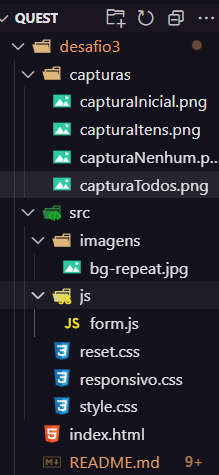
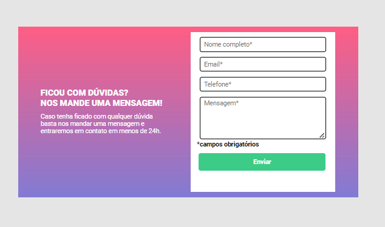
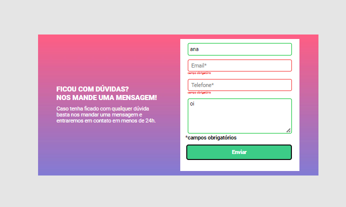
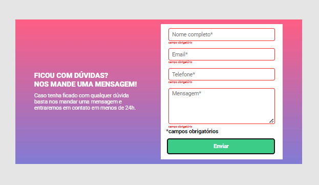
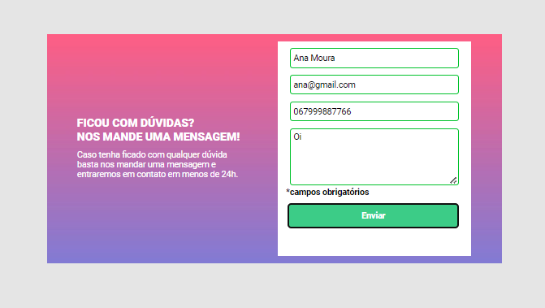
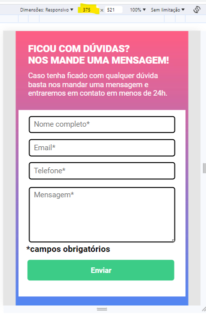

# Desafio - Formulário

## Bem-vindos

Meu segundo desafio Quest, minha solução para: [Desafio 3 - Formulário]

## Estrutura de pastas

## Layout Inicial Esperado

## Layout em desktop obtido 1

![]

## Layout em desktop obtido 2

[]

## Layout em desktop obtido 3

[]

## Layout em mobile

## Tecnologias Usadas na construção

- HTML 5
- CSS 3
- Flexbox
- JavaScript(Intermediário)

## Desenvolvimento Contínuo

O JS é muito interessante mas requer exercício constante, também oferece mais de uma solução para os desenvolvimentos, até aqui preciso fazer mais desafios.

## Dificuldades que tive

Tive algumas dificuldades para desenvolver a segunda parte do JS onde aparecem os alertas e avisos em vermelho(vide layout 2)

## Referências

Curso de programação frontend: DevQuest até o módulo JS-Intermediário  - Dev em Dobro.

<https://developer.mozilla.org/pt-BR>
<https://www.w3schools.com/css/css_rwd_intro.asp>
<https://www.devmedia.com.br/criando-form-de-contato-com-html5-css3-e-javascript/29415>
<https://medium.com/@jezmael/como-validar-os-dados-de-um-formul%C3%A1rio-com-javascript-abdc5a5fba67>

E um amigo que me deu dicas para finalizar.

## Sobre mim

Formada em Tecnologia de Análise e Desenvolvimentode Sistemas pela Unigran.
Cursando: Programação Front-end DevQuest.

## Mensagem Final

"É fazendo que se aprende a fazer aquilo que se deve aprender " Aristóteles.

2023-09-29
